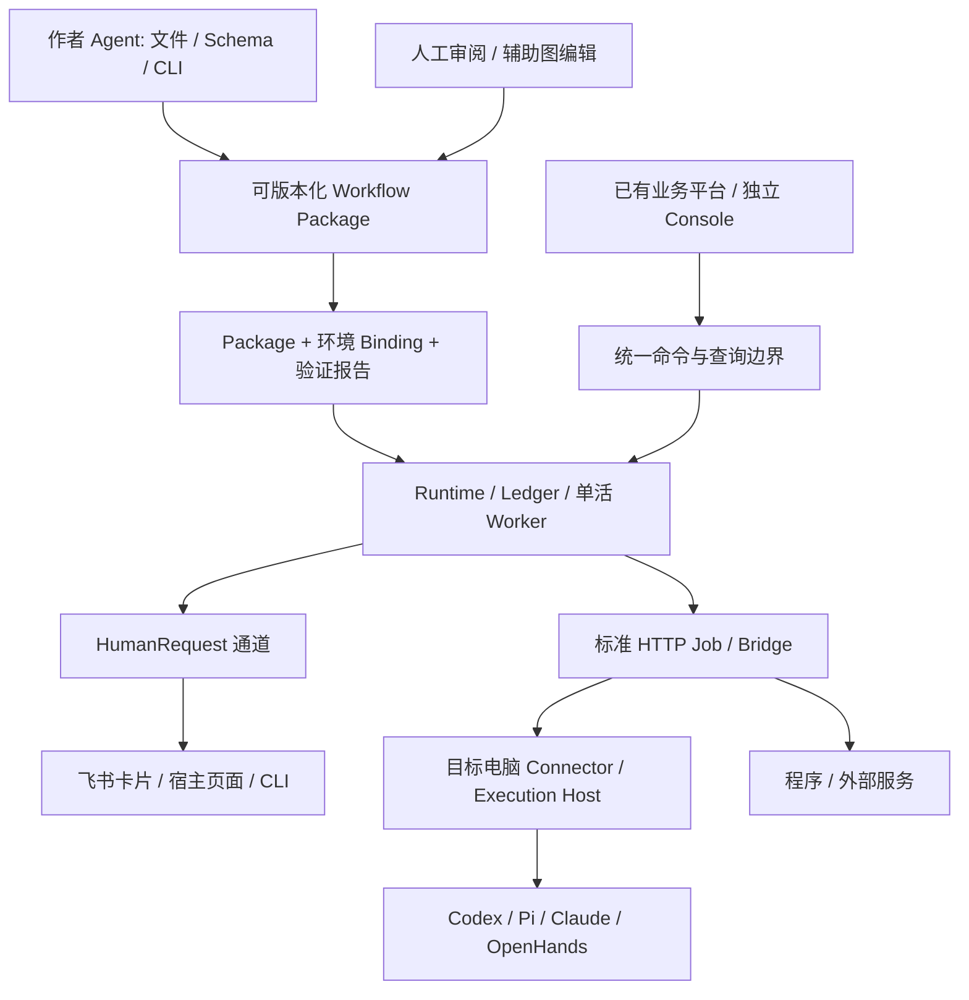

# Multiverse：以 Agent 为第一开发者的可移植协作运行层

调研日期：2026-09-26。源码基线：`b0d6c1b`（`dev`）。本文是竞品研究、设计理由与实施建议；行为要求以 [唯一规范](../spec/MULTIVERSE_SPEC.md) 为准。下文明确区分已实现、待实现与研究判断。调研没有执行竞品性能基准，也没有实连飞书或远程 CLI。

## 1. 产品判断

最值得强化的组合是：**Agent 可以快速编写和验证的人机协作包，换宿主、执行端与人工渠道时保留业务契约、运行事实和审阅证据。**

“能接很多模型”“有流程图”“有记忆”“支持人工审批”都已有成熟产品。Multiverse 的机会是把以下能力做成同一个小而可靠的交付单元：

- Agent 通过文件、Schema、能力目录、精确诊断和 CLI/API 完成开发，不依赖拖图。
- 人、程序、Agent、外部服务共享调用和产物契约，但各自保留身份与权限边界。
- 业务 Workflow 与环境 Binding 分离；宿主适配一次，后续流程复用。
- 同一流程既能独立运行，也能嵌入已有平台；远程电脑只是执行位置。
- 可解释地切换执行器和会话，保留证据，不把“上下文连续”误称为“原生进程无损迁移”。

这是**目标差异化**，不是已经证明的独占能力。需要用第二个宿主、第二个业务流程和真实断线恢复来证明。

## 2. 当前项目到底具备什么

| 源码证据 | 已有基础 | 对目标的缺口 |
|---|---|---|
| `protocol/models.py`、`compiler/`、`schemas/` | 严格资源模型、确定性编译、逻辑 slot、业务 Schema、结构化诊断 | 缺少完整配置 Schema 发现、语义 diff、交付清单和安装闭环 |
| `runtime/ledger.py`、`runner.py`、`worker.py` | SQLite 台账、持久等待、单活 Worker、版本化控制、unknown 核对 | 不是多租户生产运行时，也没有分布式调度保证 |
| `runtime/http_job.py`、HTTP Job 测试 | 标准任务提交、lookup、观察修订与恢复边界 | 任意 SaaS 仍需 Bridge；缺少可安装远程 Connector |
| `service/`、`api/`、`inspector/` | 服务命令、查询、SSE、人工请求、运行图与控制 | 不是已发布的通用 UI SDK；宿主身份委托未完成 |
| `runtime/executors.py`、`ollama.py` | JSON 本地程序、真实本地 Ollama 调用 | 没有 Codex/Pi/Claude 生命周期适配；本地进程不是沙箱 |
| 唯一规范 §27—28 | 已提出配置、工作区、会话和远程执行分离 | 尚无会话切换事务、Connector 租约、工具副作用台账的完整实现 |

源码比“只有一个概念”成熟，但距离“任意平台即插即用”仍有明确差距。不要用越来越多的规范章节代替接入纵向验证。

## 3. 竞品与可复用项目

Stars 来自当天 GitHub API，只用于选样，不代表质量；精确抓取时间、仓库地址、许可元数据见 [快照](2026-09-26-repository-snapshot.json)。以下比较基于官方仓库/文档；“对 Multiverse 的启示”是本次分析。

| 项目（当天约数） | 已有强项 | 对 Multiverse 的启示与差异化空间 |
|---|---|---|
| [n8n](https://github.com/n8n-io/n8n) · 206k | 可视自动化、丰富连接器、代码节点、自托管 | 学连接器配置与模板复用；已有平台可把 n8n 整个工作流当执行器。避免重新建设连接器全集，优先做跨执行端交付和 Agent 原生编写。仓库标为 fair-code，不应笼统称为宽松开源。 |
| [Dify](https://github.com/langgenius/dify) · 157k | AI 应用、RAG、模型和工具管理、自托管 | 学应用发布体验；可包装 Dify 应用成为逻辑 slot。Multiverse 不必要求用户迁移已有知识库、模型配置与应用平台。其许可有额外条件，不能直接假定 Apache-2.0 无附加限制。 |
| [Langflow](https://github.com/langflow-ai/langflow) · 155k | 可视组件组合与 AI 应用构建 | 学组件契约和发现；Multiverse 的作者主要是 Agent，流程图从文件生成，布局不参与执行语义。 |
| [LangGraph](https://github.com/langchain-ai/langgraph) · 42k | 持久图执行、人工中断；thread checkpoint 与跨 thread store 分离 | 借鉴线程状态和长期记忆分层；执行器可用它，业务包不暴露其内部对象。当前 Multiverse 未接入其持久后端，不将未来集成当作现有能力。 |
| [Temporal](https://github.com/temporalio/temporal) · 23k | 持久执行、历史回放、活动与工作流分离 | 借鉴恢复和副作用边界；先完善现有单活台账，不立即引入第二套调度权威。未来以负载、恢复指标决定是否引入后端。 |
| [OpenHands](https://github.com/OpenHands/OpenHands) · 89k | 面向软件工作的 Agent SDK、工作区和远程 Agent Server | 复用执行层，学习本地/远程同构；它也支持嵌入，不能以“别人只能独立运行”作为卖点。Multiverse 应突出跨角色、跨既有执行栈的流程交付。 |
| [Pi](https://github.com/earendil-works/pi) · 109k | SDK、长期 RPC 子进程、会话命令与事件 | 适合第一个轻量 Coding Agent Bridge；采用结构化 RPC，不抓终端 ANSI。旧 `badlogic/pi-mono` 链接当前重定向，适配测试必须锁版本。 |
| [Letta](https://github.com/letta-ai/letta) · 25k | 有状态 Agent、持久记忆 | 借鉴记忆生命周期；可接为记忆/Agent 提供方。长期身份延续不需要把所有任务塞进一个 CLI session。 |
| [CopilotKit](https://github.com/CopilotKit/CopilotKit) · 38k | 嵌入应用的 Agent 前端与 AG-UI 生态 | 借鉴宿主交互和事件适配；Multiverse 台账仍拥有流程事实，UI 组件只是客户。 |

与许可有关的判断只依据项目当前声明；分发/嵌入之前还需核对拟使用的具体组件。参考 [n8n 仓库许可说明](https://github.com/n8n-io/n8n#license)、[Dify 许可正文](https://github.com/langgenius/dify/blob/main/LICENSE)。本次不复制第三方实现代码。

### 直接借鉴哪些机制

| 官方资料 | 借鉴机制 | 保留的 Multiverse 边界 |
|---|---|---|
| [LangGraph persistence](https://docs.langchain.com/oss/python/langgraph/persistence) | checkpointer 面向单 thread；store 跨 thread | 工作流事实、会话历史、长期记忆分别管理 |
| [Temporal execution](https://docs.temporal.io/workflow-execution) | 用历史恢复工作流进度 | 外部写入仍需幂等键/lookup，不能推导“所有副作用恰好一次” |
| [Codex App Server](https://learn.chatgpt.com/docs/app-server) | thread start/resume/fork、turn 与审批交互 | 原生 ID 是适配器引用；支持性按安装版本验证 |
| [Claude Agent SDK sessions](https://code.claude.com/docs/en/agent-sdk/sessions) | 指定 session resume、fork；会话不等于文件快照 | 不用“当前目录最近会话”承载多人任务；文件另做快照/交接 |
| [Pi RPC](https://raw.githubusercontent.com/earendil-works/pi/main/packages/coding-agent/docs/rpc.md) | JSONL 命令与事件；接收确认不等于完成 | Bridge 负责请求关联、完成判定、持久恢复；锁定事件版本 |
| [OpenHands SDK](https://docs.openhands.dev/sdk) | Agent、Conversation、Workspace 与远程执行 | 多种执行层可替换，不把某 SDK 写进核心 Workflow |
| [Letta stateful agents](https://docs.letta.com/v1-sdk/concepts/stateful-agents) | 持久 Agent 状态与记忆 | 记忆是授权数据，不是审批或完成事实 |
| [ACP session setup](https://agentclientprotocol.com/protocol/v1/session-setup) | 显式能力协商，支持 loadSession 才恢复 | 不把协议存在当成所有 CLI 都能恢复或跨机器搬迁 |
| [AG-UI](https://docs.ag-ui.com/introduction) | 面向前端的事件与双向交互 | SSE/AG-UI 投影不建立第二个状态权威 |
| [A2A task lifecycle（固定 v0.3.0 资料）](https://a2a-protocol.org/v0.3.0/topics/life-of-a-task/) | context 和 task 分离、终态任务不可重启 | 仅借鉴对象边界；实际 Adapter 另选并锁定协议版本，不默认此版本为最新 |

协议分工：MCP 连接工具/数据；ACP 连接交互式编码 Agent；A2A 连接外部任务；AG-UI 连接用户界面；Multiverse 定义跨参与者流程的可靠推进、证据与交付。用 Adapter 连接这些协议，不强迫它们变成同一协议。

## 4. 可移植性要交付什么

这是目标架构图，Connector、飞书通道与 Coding Agent Bridge 均尚待实现。

**三个可安装交付面：**核心 Python 库/CLI；独立 Runtime 服务；可选宿主客户端和视图组件。先交付 HTTP sidecar 模式，降低语言绑定和宿主升级耦合。Python 内嵌沿用同一服务应用层；前端先提供受控独立页集成，再按真实宿主需求拆组件。iframe 可是过渡选择，但不是“所有平台已兼容”的证明。

**同一份业务包，三套环境绑定：**本机开发绑定；已有平台绑定；远程电脑绑定。包保留图、Schema、Prompt/Skill、策略要求、验收输入及依赖摘要；环境保留实际账号、地址、目录、凭据引用和授予权限。不要把账号、会话目录或运行台账导出为模板的一部分。

**宿主接入的最小闭环：**用户身份与租户映射 → 启动并关联业务对象 → 查询/订阅 → 人工决定 → 暂停/恢复/取消 → 按引用读取产物。宿主不写 Ledger。认证由宿主后端委托；浏览器不保存服务管理员长期 token。相同命令具有相同幂等和版本要求，独立 Console 也走同一路径。

**程序与飞书分两条接入：**读写飞书表格/文档是程序调用，有应用权限和业务写入去重；飞书人工任务是 HumanRequest 通道，有真人身份、主题摘要和版本检查。群消息、卡片点击和应用机器人身份都不能直接冒充批准人。

**远程电脑：**Connector 主动出站连接，登记用户明确选择的 CLI、目录、环境与版本；持久保存 dispatchKey、实际执行引用和观察游标。不能随意枚举并接管整台机器的所有 session。断网显示观察过期，不能自动把任务改派到另一台机器重做外部写入。

## 5. Agent、会话、实例、记忆如何拆开

| 对象 | 作用与关系 |
|---|---|
| AgentIdentity | 长期逻辑身份，属于 namespace；可以有多个配置版本、多个会话、多个执行位置 |
| AgentProfileRevision | 不可变行为/工具/模型偏好配置；默认不含活动 session 与凭据 |
| CollaborationThread | 一项协作任务的业务上下文，可关联多人和多个 Agent；不是某 CLI 的 session |
| AgentSession | 某 Agent 在授权 scope 中的一条上下文分支；原生恢复和跨后端续接分别记录 |
| NativeSessionBinding | provider + 安装/存储身份 + 原生 session ID + 兼容版本；阶段性关联，不是永久一对一 |
| ExecutionTarget | 电脑/服务器上的受管运行目标；一台机器可以提供多个 CLI 和执行配置 |
| WorkspaceRevision | 工作内容基线、挂载、所有者、分支/副本；相同路径不代表相同工作区 |
| ExecutionPolicyRevision | 文件、网络、工具、身份、沙箱/资源要求；审批针对具体 revision 与动作 |
| Invocation / Attempt | 工作流调用与实际尝试；与 session/turn 建立关联，但不等同 |
| MemoryNamespace / Record | 跨会话可检索知识，独立的 ACL、来源、版本、保留和删除策略 |

一个 Agent **不需要绑定唯一会话**，也不需要永久绑定某个 CLI。执行一个有状态 turn 时必须有明确的本次 native binding；无状态调用可以完全没有持久原生 session。默认按任务隔离，同一项目中显式复用，跨项目不能因 Agent 同名而自动共享历史。

### 切换规则

| 操作 | 可以保留什么 | 前置条件和限制 |
|---|---|---|
| 新建 | 身份、配置、明确授权输入和记忆 | 默认模式；不自动读“最新 session” |
| 原生 resume | 相同后端的原生历史 | 已核验存储身份/版本/工作区/策略；拿到单写租约；不存在未核对执行 |
| 原生 fork | 指定 checkpoint 以前的兼容历史 | 后端明确支持；新分支/原生 ID；并行文件写入另行隔离 |
| 跨 CLI handoff | 目标、约束、已确认事实、产物、下一步和获准记忆 | 新建目标原生 session；可携带历史摘要但不称为无损恢复 |
| 换机器 | 经验证的工作区快照与上述 handoff | 不能只复制 session ID；原生迁移为可选、逐后端验证能力 |
| 换权限/工作区 | 授权过滤后的任务上下文 | 默认创建新的执行上下文；重新编译权限与检查资料，旧审批不自动继承 |

同一业务任务可以从 Pi 续接到 Codex，再由人验收；NativeSessionBinding 形成有来源的历史链，不覆盖旧记录。新执行端不能获得原始推理内部状态、进程、未提交工具调用或旧凭据的“隐式迁移”。

**切换事务：**停止新派发 → 等待/核对在途工作 → 封存上下文、产物和工作区基线 → 检查目标授权 → 创建目标 binding → CAS 更新版本和 fencing token → 获取单写租约 → 执行。失败时保留旧关联与失败证据；旧 executor 的迟到回报不能凭旧 token 推进新分支。租约过期并不证明旧进程已停止。

**多人多 Agent 协作：**各自会话与默认独立可写副本，共享已登记 Artifact、显式任务输入和获准记忆。共享目录须串行租约或经过验证的协调机制。合并工作区是一项显式业务操作，可审阅 diff；不要合并聊天 transcript 来假装合并工作结果。

**记忆：**分个人偏好、Agent 经验、项目知识和组织知识；ACL 不能只按 agentId 划分。每次注入保存记录 ID、版本、来源、裁剪与实际注入摘要；写入先是候选，冲突按版本更新。外部知识库可原地授权检索，不强制搬进 Multiverse。权限收窄时，已读过的秘密不能靠禁用工具“忘掉”，需要创建干净上下文；旧 native session 的访问也要撤销。首阶段保留规范默认关闭语义检索，不先造向量平台。

## 6. 沙箱和权限不足

| 场景 | 建议执行模式 | 必须真实具备的边界 |
|---|---|---|
| 可信个人本机、已审核脚本 | 明确选择 trusted local，可不额外套容器 | 明示继承 OS 用户权限；可控目录/账号；不声称有隔离 |
| Agent 生成代码、第三方包、多人任务 | 隔离工作区 + 被验证的沙箱 | 挂载、网络、身份、进程树、时间和资源控制；没有实现则拒绝声明支持 |
| 已在受控容器/VM 中的 CLI | 复用外层隔离，避免无意义双层沙箱 | 记录实际实施者、可验证策略；容器标签本身不是证明 |
| 单纯模型调用或 SaaS 工具调用 | 可不创建本地代码沙箱 | 服务端权限、网络出口、Secret broker、审计；仍有授权边界 |
| 需要部署/发布等高权限动作 | 单独受控程序节点或窄能力 broker | 针对动作、资源、输入摘要、时限和次数的授权；不开放整个 Agent 主机 |

权限至少取组织/租户、发起主体、部署 Binding、工作区、执行端和工具服务的交集。沙箱决定“技术上能访问什么”，授权决定“本次允许做什么”，审批决定“是否批准这项具体动作”；三者不能互相替代。

权限不足不能统一重试，更不能自动关闭沙箱。先判断缺的是挂载/依赖、网络、工具 scope、OS 权限还是根本不支持的能力；优先补齐已授权范围、使用窄工具代理、换合适执行节点。确需新授权时创建权限请求并暂停相关执行。批准后冻结新策略并核验实施，再恢复/创建新上下文；拒绝或超时要有可解释结果。外部系统不允许提升的权限，平台也不能凭审批绕过。

## 7. Agent 是第一开发者：开发体验应怎样变化

主要路径是 **discover → scaffold → edit → validate → preflight → test → semantic diff → review → install**。这是一组产品动作；当前 CLI 只有其中部分，不能把未来命令写成可运行示例。

1. **发现成本低。**一份短入口文档链接版本匹配的 Schema、能力目录与最小例子；目录区分声明、安装、可用、验证。按需求拉取详细契约，避免每次把整本规范放入上下文。
2. **修改成本低。**稳定 node/slot ID，小文件、显式引用、业务 Schema；一处变更通常只改相关节点与输入输出契约。图布局独立，不因拖动画布重写流程全文。
3. **错误可修复。**固定 code、file、JSON Pointer、expected/actual、建议和依赖链；尽可能一次返回独立错误。JSON stdout 不混日志；失败以非零退出。
4. **修改可核验。**无副作用校验和预检先行；fixture 再测分支，授权实测再测外部集成。预检输出未检查项，避免模型把静态成功误读为服务已通。
5. **变更可审阅。**语义 diff 标出输入输出、边/分支、能力、权限、依赖、session/工作区策略和验收变化，绑定源包/Binding 摘要，避免批准旧版本。
6. **跨工具一致。**Codex、Pi、Claude 或普通脚本都能操作文本和 CLI；MCP 作者工具只是同一命令层的可选薄封装，不建立专有作者协议。
7. **人有有效控制。**图形界面侧重运行解释、diff 审阅、表单、授权和辅助编辑。GUI 保存也走同一编译器与版本冲突检查；不能从浏览器修改运行事实。

作者 Agent 和运行 Agent 分开。能写流程不意味着能运行高权限节点、批准自己或激活部署；人类辅助编辑不意味着人类必须承担逐节点配置劳动。

### 建议的可测产品目标（尚未实测）

- 首个最小流程：已有工具环境中，作者 Agent 10 分钟内从目标到 fixture 跑通。
- 第二个业务流程：不改核心，不新增平台 Glue，只增加包、业务契约和 Binding。
- 同包换目标：package digest 保持不变；差异出现在 Binding 和能力缺口报告。
- 固定至少 20 个作者任务（创建/局部编辑/修复/重绑定）：记录首次验证通过率、修复回合数、Token/时间、误用权限次数；全部失败计入分母。
- 正确性门槛先于速度：零凭据进入包、零未经授权的审批绕过、零 unknown 写入自动重发；这些是验收要求，不是本次测得的结果。
- GUI 往返保存后业务语义摘要不因布局变化而改变；必须处理并发编辑冲突。

## 8. 实施顺序与完成门槛

遵循唯一规范 §24 的纵向次序，不另建竞争路线。以下是把优先级映射到可验收交付。

| 顺序 | 交付 | 完成证据 |
|---|---|---|
| 现在 | 产品定位、Agent 作者入口、独立静态预检、能力声明准确性 | CLI 正反例、失败位置、无执行副作用、现有测试通过 |
| 下一纵切 | 一个真实 Coding Agent Bridge + HumanRequest + 程序验证 | 真实 CLI 产物进入台账，用户关页面再回来仍可审批；响应丢失不重复启动 |
| 接入复用 | 标准 Bridge 支持第二个 CLI；飞书 Human 通道与程序动作分离 | 一份包替换 Binding；验签、身份映射、重复回调、过期卡片、断线重试测试 |
| 跨电脑 | Connector 出站连接、单次配对、撤销、租约和恢复 | 两台目标机；失联/重启/迟到结果/未知写入的真实测试 |
| 嵌入交付 | 一个真实业务宿主 + 独立 Console，最小交付锁与安装流程 | 两个平台复用同一包；第二个流程不改宿主 Glue；干净目标重现 |
| 连续性 | 原生 resume/fork、跨 CLI handoff、工作区/权限变更 | 兼容矩阵、单写控制、权限收窄上下文清理、并行工作区隔离测试 |
| 作者效率 | Schema/配置发现、语义 diff、可复用测试套件 | 固定作者任务集及与旧路径的对照结果 |

首个执行端建议 Pi RPC：轻量且适合现有 Python Worker 的进程边界；紧接 Codex App Server，以第二种生命周期验证抽象。Claude 使用官方 Agent SDK/结构化接口。若现有业务已有 Codex 或 OpenHands 服务，可调整首个目标，不改变核心对象边界。

**不要先扩张：**多活 Worker、通用记忆平台、可视编辑器复杂交互、所有协议同时接入。这些会延后“作者 Agent 写一个包，在另一个平台真实运行”的最有辨识度证据。

## 9. 本轮交付与剩余边界

本轮补充研究、规范和 Agent 作者入口；新增 `mverse preflight --json`，复用编译器与 Runtime 注册表预检，给出具体 Binding/节点定位和未检查项；修正本地进程的权限保证声明。

本轮没有实现远程 Connector、飞书应用、三个 CLI Bridge、原生会话迁移、长期记忆库或沙箱后端。不能把架构定稿和静态测试当成这些集成已经可用。飞书官方动态文档在本次抓取中未能取得可核验正文，通道设计沿用本项目既有 HumanRequest 约束；具体验签算法、事件形状、响应期限和重试规则须在真实接入前按所选飞书接口核验。
